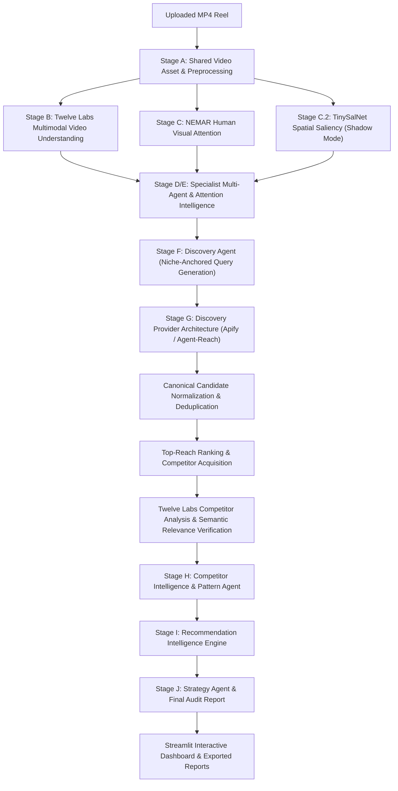

# ViralLens AI — End-to-End System Architecture

---

## Stage-by-Stage Specifications

### 1. Stage A: Shared Video Asset & Preprocessing [PRODUCTION]
- **Purpose**: Validate MP4/WebM integrity, probe video metadata (fps, dimensions, duration), and prepare standardized decoded audio/frames.
- **Input**: Local or uploaded video file.
- **Output**: Validated video path, frame samples, metadata object.
- **Technology**: OpenCV, FFmpeg.
- **Limitations**: Corrupt or zero-byte files are rejected early.

### 2. Stage B: Video Understanding [PRODUCTION]
- **Purpose**: Extract high-level multimodal semantics, scene descriptions, topics, and spoken audio transcripts.
- **Input**: Target MP4 video.
- **Output**: Multimodal semantic analysis dictionary.
- **Technology**: Twelve Labs Pegasus 1.5 API.
- **Limitations**: Dependent on outbound HTTPS network access to Twelve Labs API.

### 3. Stage C: Temporal Visual Attention [RESEARCH-DERIVED]
- **Purpose**: Predict frame-by-frame visual attention potential curves to locate opening hooks, mid-reel retention drops, and peak focus moments.
- **Input**: Video frame luminance, color contrast, and motion features.
- **Output**: 0.0–1.0 attention score timeseries and timeline events.
- **Technology**: Frozen NEMAR model (`model.pkl` + `scaler.pkl`).
- **Limitations**: Calibrated on laboratory eye-tracking; not direct mobile scroll telemetry.

### 4. Stage C.2: Spatial Saliency [EXPERIMENTAL]
- **Purpose**: Calculate spatial fixation dispersion and visual conspicuity across sampled frames.
- **Input**: Sampled video frames.
- **Output**: Spatial saliency maps, focus dispersion metrics.
- **Technology**: TinySalNet (`spatial_model.pt`, SHA-256: `fd6f27fd...`).
- **Limitations**: Evaluated in non-blocking shadow mode.

### 5. Stage D/E: Multi-Agent Attention Intelligence [PRODUCTION]
- **Purpose**: Synthesize specialized analytical evaluations across 7 domain dimensions (Human Attention, Hook, Behavior, Emotion, Editing, Communication, Specialist OCR).
- **Input**: Stage B & C outputs.
- **Output**: Domain findings, observations vs interpretations, typography timings.
- **Technology**: Multi-Agent orchestration suite.
- **Limitations**: Non-causal qualitative and empirical synthesis.

### 6. Stage F: Niche-Anchored Query Generation [PRODUCTION]
- **Purpose**: Derive 3–5 multi-word, niche-anchored search queries reflecting the specific entity, format, and topic of the target Reel.
- **Input**: Discovery Profile derived from target video analysis.
- **Output**: Ordered query hierarchy (high precision, medium broad, fallback).
- **Technology**: Discovery Agent & QueryBuilder.
- **Limitations**: Zero single-word queries permitted.

### 7. Stage G: Discovery Provider Architecture [PRODUCTION / EXPERIMENTAL]
- **Purpose**: Query external platforms for competing Reels with isolated caching, smart platform-block resilience, and bounded retries.
- **Input**: Search queries.
- **Output**: Raw candidate lists and diagnostic telemetry.
- **Technology**:
  - Primary: Apify Instagram Search Scraper (`apify/instagram-search-scraper`). [PRODUCTION]
  - Secondary: Agent-Reach / OpenCLI. [EXPERIMENTAL]
- **Limitations**: Subject to live Instagram platform challenge and anti-scraping responses.

### 8. Candidate Normalization, Deduplication & Relevance [PRODUCTION]
- **Purpose**: Canonicalize URLs, strip tracking query parameters, preserve genuine integer views (missing = None), deduplicate cross-provider, and verify semantic relevance.
- **Input**: Discovered candidate objects.
- **Output**: Verified relevant competitor cohort (capped at 10, max 2 per creator).
- **Technology**: `services/discovery_provider.py`, `services/relevance.py`.
- **Limitations**: Preserves verified views; never fabricates reach from likes or comments.

### 9. Stage H: Competitor Intelligence & Pattern Discovery [PRODUCTION]
- **Purpose**: Contrast target Reel against verified competitor cohort to identify recurring observable characteristics and structural gaps.
- **Input**: Target analysis + cohort analyses.
- **Output**: Recurring pattern catalog with strict denominator accounting.
- **Technology**: `CompetitorIntelligenceService`, `PatternAgent`.
- **Limitations**: Descriptive peer group comparison, not population-wide rules.

### 10. Stage I: Recommendation Intelligence [PRODUCTION]
- **Purpose**: Translate pattern gaps and attention curves into structured, evidence-backed creative recommendations.
- **Input**: Target profile, attention curves, competitor pattern catalog.
- **Output**: Prioritized recommendation graph with creative rationale, testable actions, and explicit limitations.
- **Technology**: `RecommendationIntelligenceService`.
- **Limitations**: Decision support tool; does not guarantee virality.

### 11. Stage J: Strategy Agent & Final Audit Report [PRODUCTION]
- **Purpose**: Consolidate all evidence, resolve inter-agent conflicts, and generate human-readable Markdown and machine-readable JSON reports.
- **Input**: Complete analytical output pipeline.
- **Output**: Persisted JSON and Markdown audit reports in `reports/`.
- **Technology**: `StrategyAgent`, `save_report()`.
- **Limitations**: Strict non-causal language enforced.
